## Project Presentation

| 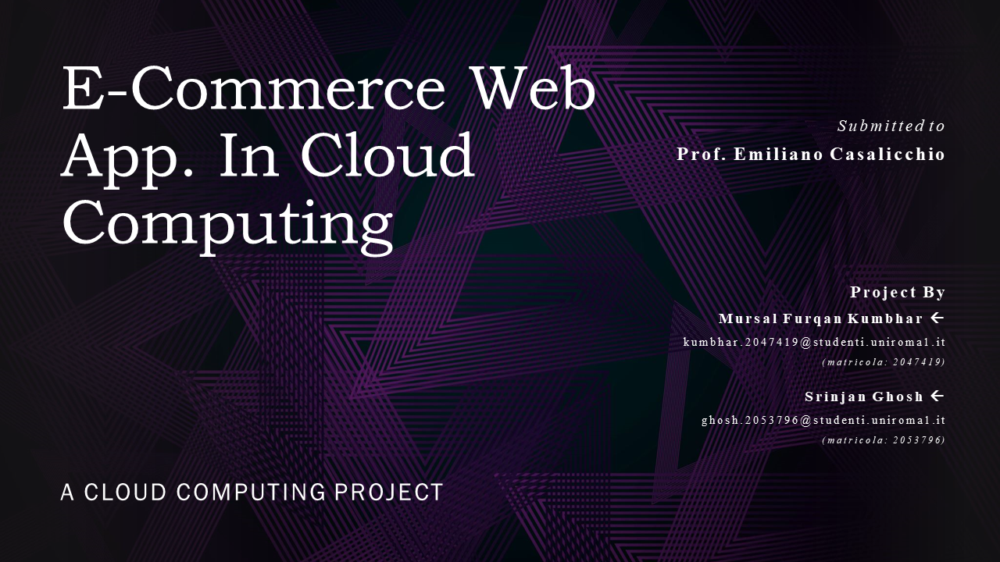 | 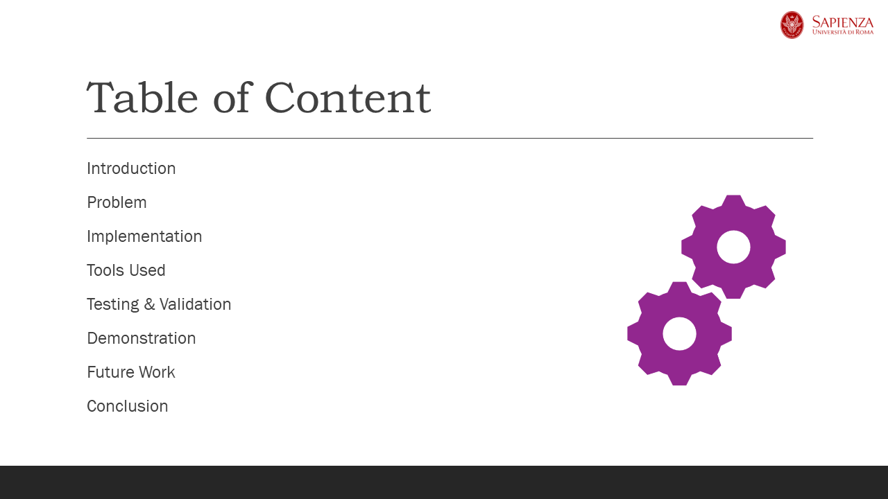 | 
|---------------------|---------------------|
|  | 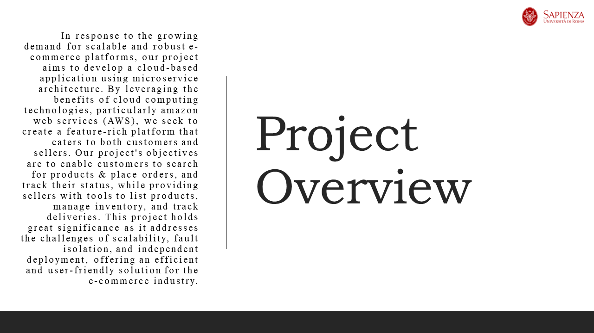 |
| 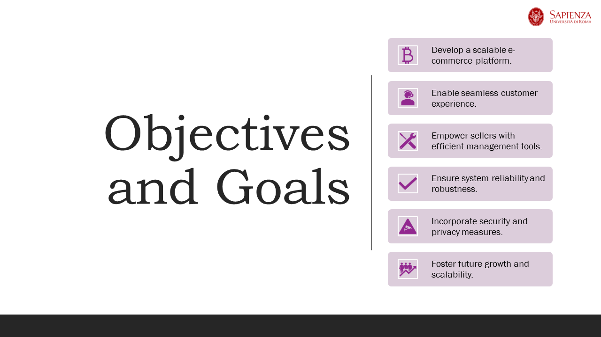 |  |
| 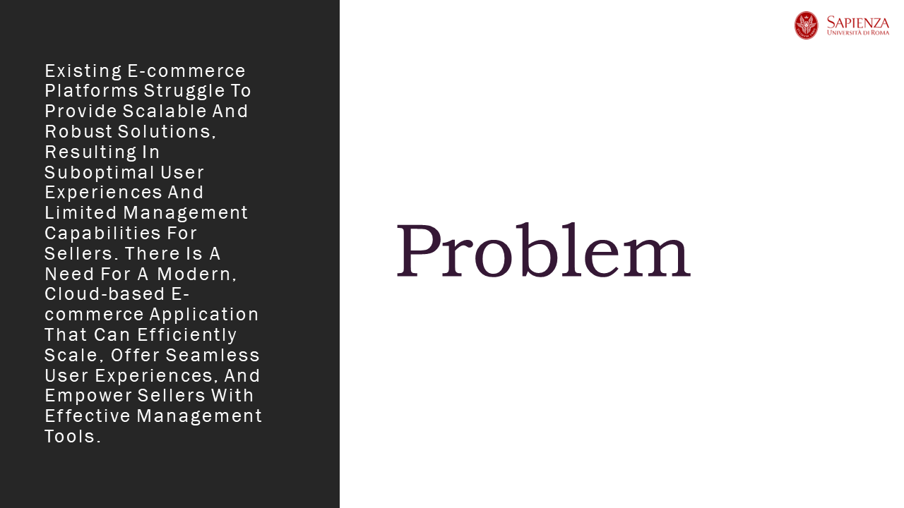 |  |
| 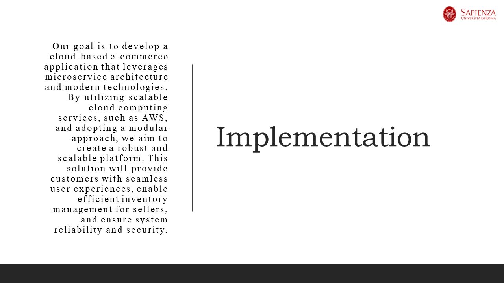 | 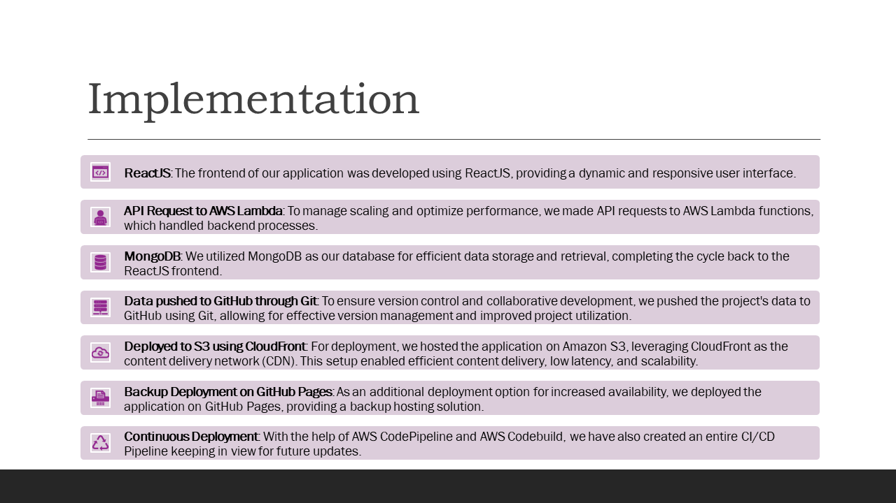 |
|  | 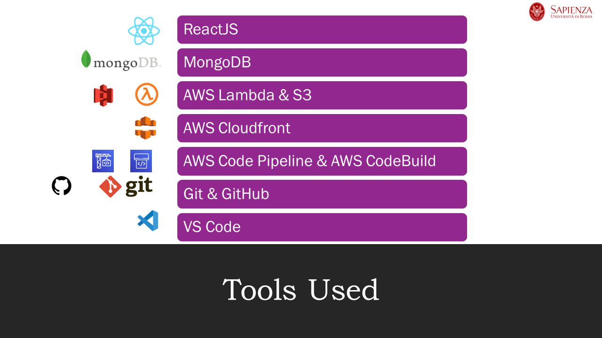 |
| 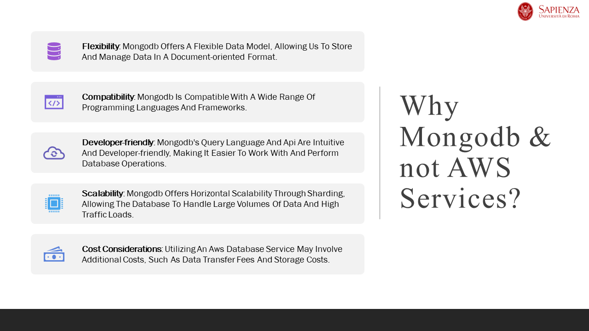 |  |
| 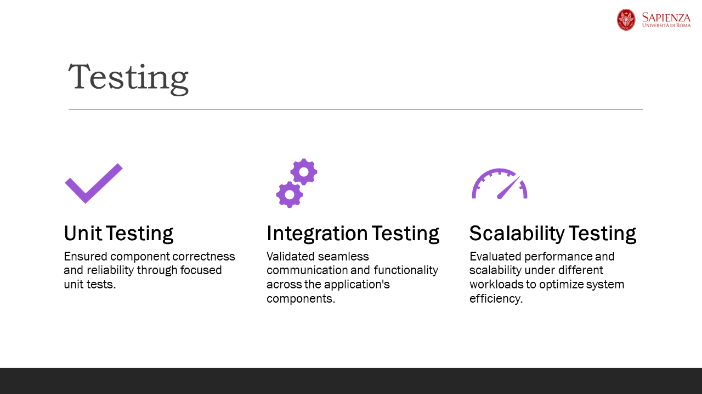 | 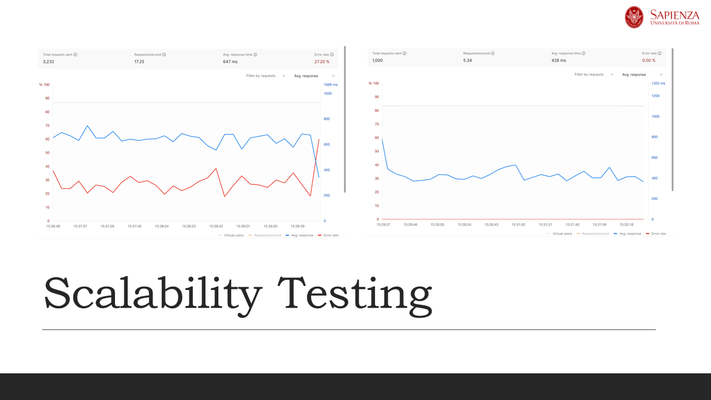 |
|  |  |
| 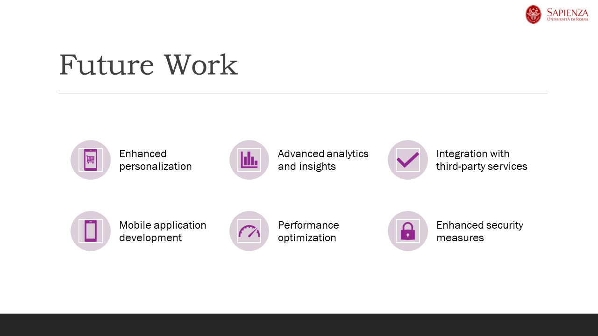 | 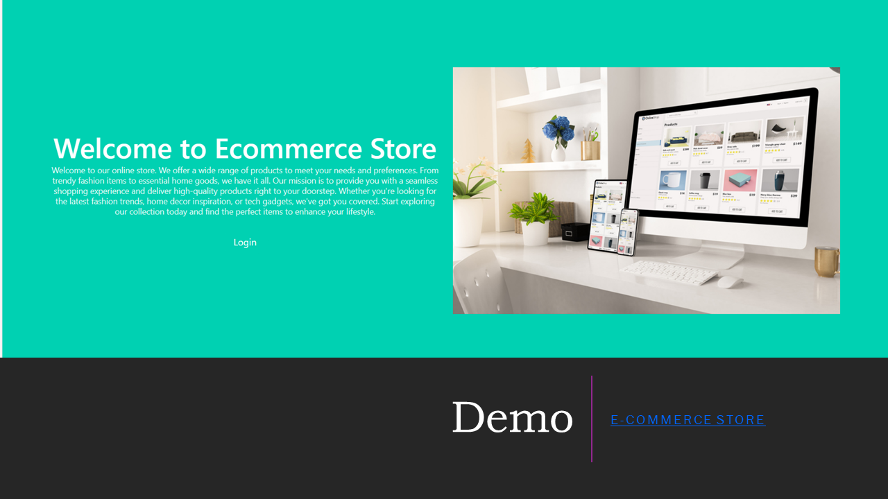 |
|  | 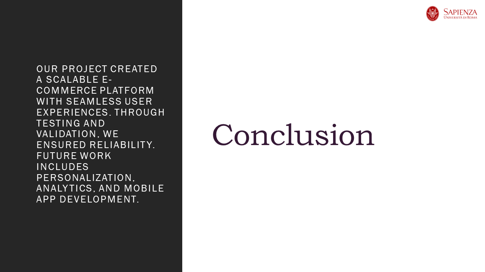 |

# A. Introduction

This project report presents the design and implementation of a scalable e-commerce application using cloud computing technologies. The goal of this project was to leverage the benefits of cloud computing, particularly the microservice architecture, to create a robust and scalable platform for both customers and sellers. The e-commerce application consists of two main components: the frontend and the backend. The frontend is designed to provide an intuitive and user-friendly interface for customers to search for products, view detailed product information, place orders, and track their order status. On the other hand, the backend is focused on enabling sellers to list their products, manage their inventory, and track the products they need to deliver.

To address the challenges of scalability and robustness, we adopted the microservice architecture. This architectural style allows for the development and deployment of loosely coupled and independently deployable services, which can be easily scaled and maintained. By leveraging cloud computing infrastructure, we ensured high availability, fault tolerance, and cost-effectiveness.

Throughout this report, we will discuss the key aspects of designing a scalable e-commerce application. We will explore the architectural decisions, technology stack, and implementation strategies that were employed to achieve our project goals. Additionally, we will examine the benefits of cloud computing and the microservice architecture in terms of scalability, performance, and resilience. The primary objective of this project was to provide businesses with a flexible and scalable e-commerce platform that can adapt to their growing needs. By harnessing cloud computing technologies and embracing the microservice architecture, we aimed to empower both customers and sellers with a seamless and efficient online shopping experience.

This report will delve into the details of our project, including the design considerations, implementation challenges, and the outcomes achieved. It will serve as a comprehensive documentation of our journey towards building a scalable and robust e-commerce application using cloud computing technologies.

# B. Problem

The problem at hand is the need to develop a scalable e-commerce application that effectively serves both customers and sellers. Traditional monolithic architectures fall short in providing the necessary scalability, robustness, and efficient management of inventory and orders. To address these limitations, the project aims to leverage cloud computing technologies, specifically the microservice architecture, to create an optimized and reliable e-commerce platform.

The key challenges to be tackled are as follows:
- Scalability: The existing architecture lacks the ability to handle increasing user traffic and accommodate future growth. As a result, the platform experiences performance issues and struggles to deliver a seamless user experience. There is a need to design a scalable solution that can handle high volumes of concurrent users and adapt to changing demands.
- Robustness: System failures, such as downtime or disruptions, can significantly impact the reliability and user trust of the e-commerce platform. To ensure business continuity, fault-tolerant mechanisms need to be implemented that can handle failures gracefully and minimize disruptions to users and sellers.
- Inventory and Order Management: Sellers encounter challenges in managing their inventory, tracking orders, and coordinating product deliveries efficiently. The current system lacks effective tools and interfaces for sellers to list products, manage inventory, and track orders seamlessly. The solution should provide comprehensive inventory and order management capabilities to streamline seller operations.
- Performance Optimization: Slow response times and sluggish page loading negatively impact user engagement and satisfaction. The application needs to be optimized to deliver fast and responsive user interfaces, minimizing latency and ensuring a smooth and efficient user experience across various functionalities, such as product searches, order placement, and tracking.
- Cost-Effectiveness: Traditional infrastructure setups often require significant upfront investments and ongoing maintenance costs. By leveraging cloud computing technologies, the project aims to optimize resource utilization and implement a cost-effective solution that allows businesses to efficiently manage expenses while scaling resources to meet growing demands.

In summary, the problem to be addressed is the design and implementation of a scalable e-commerce application using cloud computing technologies and the microservice architecture. By overcoming the challenges of scalability, robustness, inventory management, performance optimization, and cost-effectiveness, the project aims to create a high-performing and efficient platform for both customers and sellers in the e-commerce ecosystem.

# C. Proposed Solution

The developed solution is a scalable e-commerce application that utilizes cloud computing technologies and a microservice architecture. The solution effectively addresses challenges related to scalability, robustness, inventory and order management, performance optimization, and cost-effectiveness.

Using a microservice architecture, the application is designed to handle high user traffic and accommodate future growth seamlessly. Independent services are developed, deployed, and scaled as needed, providing scalability and flexibility.

Robustness is achieved through fault-tolerant mechanisms. Load balancing mechanisms distribute traffic efficiently, ensuring high availability and seamless user experience. Failures are handled gracefully, minimizing disruptions to users and sellers.

Inventory and order management are streamlined using MongoDB as the database. Sellers have access to comprehensive tools and interfaces to manage inventory, track orders, and coordinate product deliveries efficiently. Performance optimization is achieved through the use of ReactJS for the frontend. The application provides fast, responsive user interfaces, enhancing the overall user experience. Content delivery is optimized using a content delivery network (CDN) for low-latency content delivery and efficient caching.

Cost-effectiveness is ensured through the utilization of cloud computing technologies. Serverless computing with AWS Lambda optimizes resource utilization and scales functions independently based on demand. The application is hosted on cloud infrastructure, minimizing upfront investments and providing cost-effective scaling options.

In conclusion, the completed project is a scalable e-commerce application that leverages cloud computing technologies and a microservice architecture. The solution effectively addresses challenges related to scalability, robustness, inventory and order management, performance optimization, and cost-effectiveness. By utilizing MongoDB, ReactJS, and other relevant technologies, the application offers a seamless online shopping experience for customers and enables sellers to efficiently manage their operations.

# D. Tools Used

During the implementation of the scalable e-commerce application, a range of tools and technologies were employed to facilitate efficient development, deployment, and management of the system. The following tools played a significant role in the successful implementation of the project:

1. ReactJS:
   ReactJS, a widely-used JavaScript library, provided the foundation for developing the user interface of the e-commerce application. ReactJS follows a component-based approach, allowing for the creation of reusable UI components. Its virtual DOM (Document Object Model) and efficient rendering enable faster and more responsive user interfaces. ReactJS, with its rich ecosystem and extensive community support, ensured the application's frontend was robust, interactive, and scalable.

2. MongoDB:
   MongoDB, a NoSQL document database, served as the backend database management system for the e-commerce application. Its flexible schema and JSON-like document structure facilitated efficient storage and retrieval of product and order information. MongoDB's ability to scale horizontally and handle large volumes of data made it suitable for an e-commerce platform with evolving needs. Its support for distributed database clusters ensured high availability and fault tolerance.

3. AWS Lambda:
   AWS Lambda, a serverless computing service, played a crucial role in managing the backend functions of the e-commerce application. With Lambda, developers can write and deploy functions without the need to provision or manage servers. Each Lambda function served a specific purpose, such as adding products, deleting orders, or updating product details. The serverless architecture of AWS Lambda allowed for automatic scaling, efficient resource allocation, and cost optimization based on actual usage.

4. Git and GitHub:
   Git, a distributed version control system, was utilized for collaborative development and version management throughout the project. It enabled multiple developers to work concurrently on the application's codebase, maintaining a history of changes and facilitating seamless collaboration. GitHub, a popular web-based hosting service for Git repositories, provided a centralized platform for managing and sharing code. It offered features such as pull requests, issue tracking, and code reviews, enhancing team productivity and ensuring efficient code management.

5. Visual Studio Code (VS Code):
   Visual Studio Code, a lightweight and extensible source code editor, was utilized as the primary development environment for the project. VS Code offered an intuitive user interface, extensive plugin ecosystem, and powerful debugging capabilities. Its support for various programming languages, including JavaScript, facilitated efficient coding, testing, and debugging of the application. With features like IntelliSense, Git integration, and terminal access, VS Code streamlined the development workflow and enhanced developer productivity.

These tools formed the backbone of the implementation, enabling efficient development, version control, and execution of the scalable e-commerce application. ReactJS provided a robust frontend framework, MongoDB ensured efficient data storage and retrieval, AWS Lambda facilitated serverless backend functions, Git/GitHub facilitated collaborative development and version control, and Visual Studio Code served as a powerful development environment.

# E. Implementation

The implementation of the scalable e-commerce application involved utilizing a combination of tools and technologies to develop a robust and efficient system. The key components and steps undertaken during the implementation are as follows:

1. Frontend Development with ReactJS:
   The user interface of the e-commerce application was developed using ReactJS, a JavaScript library known for its component-based architecture. ReactJS facilitated the creation of reusable UI components and provided a seamless and responsive user experience. The frontend components were implemented following best practices, such as modularization, state management, and optimized rendering, to ensure efficient frontend development.

   ReactJS was chosen for frontend development due to its component-based architecture and efficient rendering capabilities. Its virtual DOM (Document Object Model) enables faster and optimized updates to the UI, resulting in a smooth and responsive user experience. Additionally, ReactJS's large and active community provides extensive support, resources, and libraries, making it a popular choice for building complex and scalable user interfaces.

2. Backend Functions with AWS Lambda:
   The application's backend functions were implemented using AWS Lambda, a serverless computing service. AWS Lambda enabled the development and deployment of scalable and independent functions that served specific purposes within the e-commerce application. Each Lambda function was responsible for tasks such as adding products, deleting orders, updating product details, and retrieving data from the MongoDB database. The serverless architecture of AWS Lambda allowed for automatic scaling and efficient resource allocation, ensuring optimal performance.

   AWS Lambda was selected for backend functions due to its serverless architecture and automatic scaling capabilities. As a serverless computing service, Lambda eliminates the need for managing infrastructure, allowing developers to focus solely on writing code. The automatic scaling feature ensures optimal resource allocation based on demand, resulting in efficient and cost-effective execution of backend functions.

3. Database Management with MongoDB:
   MongoDB, a NoSQL document database, was utilized as the backend database management system. MongoDB's flexible schema and document-oriented structure allowed for efficient storage and retrieval of product and order information. The database schema was designed to accommodate the application's data requirements, such as product details, order information, and user data. MongoDB's scalability and fault-tolerant features ensured the system could handle large volumes of data and maintain high availability.

   MongoDB was chosen as the database management system due to its flexible schema and scalability. Its document-oriented nature allows for easy handling of complex data structures and dynamic schemas, making it suitable for evolving e-commerce applications. MongoDB's horizontal scalability enables efficient distribution of data across multiple servers, ensuring high availability and fault tolerance.

4. Collaboration and Version Control with Git and GitHub:
   Git, a distributed version control system, was employed for collaborative development and version management. Git allowed multiple developers to work simultaneously on the application's codebase, maintaining a history of changes and facilitating seamless collaboration. GitHub, a web-based hosting service, served as a centralized platform for managing and sharing code. It provided features such as pull requests, issue tracking, and code reviews, ensuring efficient collaboration and code management.

   Git and GitHub were utilized for collaboration and version control due to their distributed nature and rich set of features. Git's distributed version control system allows multiple developers to work on the same codebase concurrently, facilitating efficient collaboration and reducing the risk of code conflicts. GitHub, as a widely-used web-based hosting service, provides a centralized platform for code management, code review, issue tracking, and seamless integration with other development tools.

5. Development Environment with Visual Studio Code (VS Code):
   Visual Studio Code, a lightweight and extensible source code editor, served as the primary development environment. VS Code provided an intuitive user interface, powerful debugging capabilities, and an extensive plugin ecosystem. Its support for JavaScript and other programming languages streamlined the development workflow and enhanced developer productivity. Features such as IntelliSense, Git integration, and terminal access facilitated efficient coding, testing, and debugging of the e-commerce application.

   Visual Studio Code was selected as the development environment for its lightweight and extensible nature. Its intuitive user interface, powerful debugging capabilities, and extensive plugin ecosystem enhance developer productivity. With built-in support for various programming languages, including JavaScript, VS Code provides a feature-rich environment for efficient coding, testing, and debugging of the e-commerce application.

Each tool was chosen based on its specific strengths and capabilities to ensure the successful implementation of the e-commerce application. ReactJS offered a scalable and responsive frontend, AWS Lambda provided serverless and scalable backend functions, MongoDB facilitated flexible and scalable database management, Git and GitHub supported collaborative development and version control, and Visual Studio Code served as a powerful and customizable development environment.

# F. Testing & Validation

To ensure the functionality, reliability, and quality of our e-commerce application, thorough testing and validation were conducted. The following approaches and techniques were employed:

- Testing
  - Unit Testing: Comprehensive unit tests were developed for individual components, focusing on specific inputs and expected behaviors.
  - Integration Testing: Extensive testing ensured seamless interactions and compatibility between different components and modules.

- Validation
  - End-to-End (E2E) Testing: Rigorous tests simulated real user interactions, validating critical functionalities and error handling.
  - Usability Testing: Extensive user testing sessions gathered feedback to enhance the user experience.

- Validation Techniques
  - Functional Validation: Extensive testing validated that the application meets specified requirements and performs accurately.
  - Performance Validation: Thorough performance testing assessed responsiveness and optimized system performance.

These testing and validation processes contributed to the reliability, robustness, and high-quality of our e-commerce application.

# G. Future Work

Although the scalable e-commerce application has been successfully implemented, there are several areas that can be further improved and expanded upon in future work. The following aspects can be considered for future enhancements:

- Advanced Search and Recommendation System: Implementing an advanced search and recommendation system can enhance the user experience by providing personalized product recommendations based on user preferences and browsing history. Integration with machine learning algorithms and data analytics can improve the accuracy of recommendations and help users discover relevant products more effectively.

- Enhanced User Authentication and Security: Strengthening user authentication and security measures is essential to protect user information and ensure a secure online shopping environment. Implementing multi-factor authentication, encrypted communication protocols, and robust access control mechanisms can enhance the overall security posture of the application.

- Integration with Payment Gateways and Third-Party Services: Integrating the e-commerce application with popular payment gateways and third-party services can provide a seamless and secure payment experience for customers. Integration with services such as PayPal, Stripe, or other regional payment providers can expand payment options and ensure compliance with industry standards and regulations.

- Mobile Application Development: Creating a dedicated mobile application for the e-commerce platform can cater to the growing number of mobile users and provide a more optimized and tailored experience. Developing a mobile app can leverage device-specific features, such as push notifications and mobile-specific UI/UX, to enhance engagement and improve user satisfaction.

- Performance Optimization and Load Testing: Continuously monitoring and optimizing the performance of the application is crucial to ensure fast response times and smooth user experiences, even during peak loads. Load testing and performance profiling can help identify bottlenecks and areas for improvement, such as database optimization, caching strategies, and content delivery mechanisms.

- Inventory Management and Order Fulfillment Enhancements: Further enhancing the inventory management and order fulfillment capabilities for sellers can streamline their operations. Integrating with shipping and logistics providers, automating inventory updates, and providing advanced reporting and analytics can improve the efficiency of order processing and fulfillment.

- Analytics and Business Intelligence: Implementing advanced analytics and business intelligence capabilities can provide insights into user behavior, sales trends, and product performance. Integrating with analytics platforms and generating comprehensive reports and dashboards can empower sellers with valuable data-driven insights for decision-making and business growth.

In conclusion, the future work for the scalable e-commerce application encompasses various areas of improvement and expansion. By considering enhancements in search and recommendation systems, user authentication and security, payment gateway integration, mobile application development, performance optimization, inventory management, internationalization, analytics, and continuous integration, the application can continue to evolve, meet evolving customer needs, and remain competitive in the dynamic e-commerce landscape.

# I. Conclusion

The completion of the scalable e-commerce application demonstrates the successful utilization of cloud computing technologies and the microservice architecture to create a robust and efficient online platform. Through the implementation process, key objectives including scalability, robustness, inventory and order management, performance optimization, and cost-effectiveness were effectively addressed. The application leveraged tools such as ReactJS, MongoDB, and AWS Lambda, while Git/GitHub and Visual Studio Code facilitated collaborative development. Future work can focus on advanced features, mobile app development, performance optimization, and expanding analytics capabilities. Overall, the completed project provides a solid foundation for further growth and success in the e-commerce domain.

* [Project Report](report_resources/report.docx)
* [Project Presentation.docx](report_resources/report.pptx)